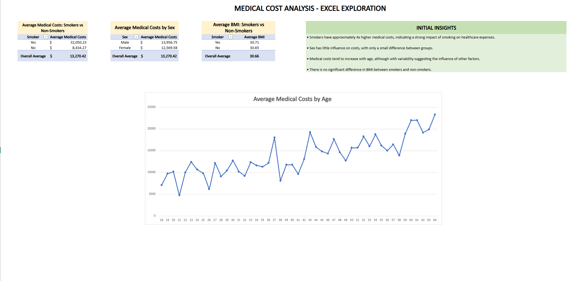
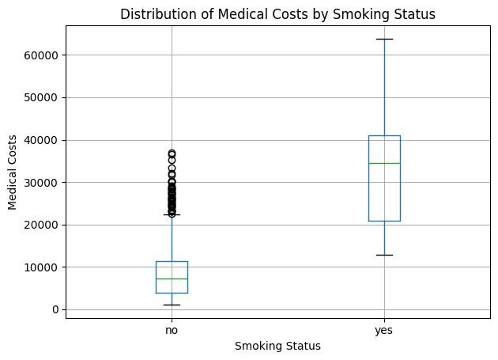
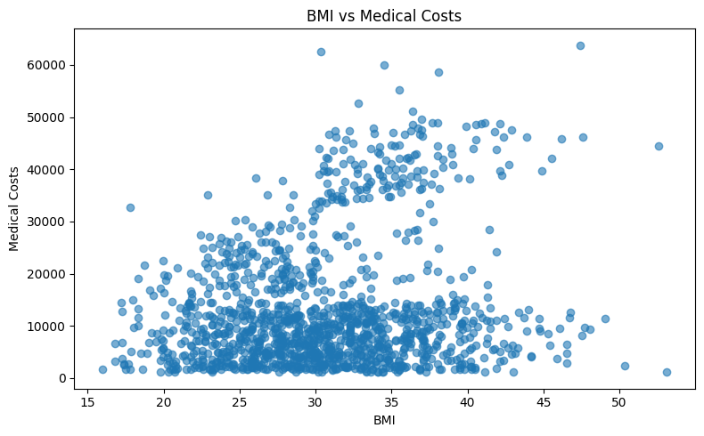
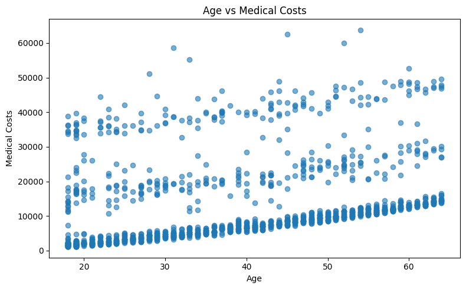
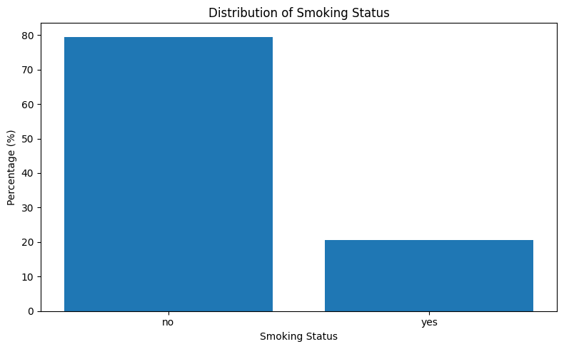
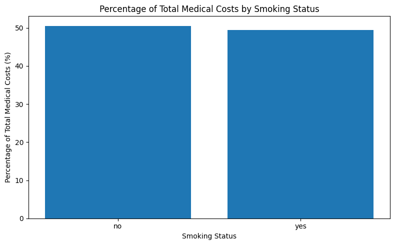

# 💰 Medical Cost Analysis

## 🎯 Objective

Analyze healthcare cost data from the United States using Python and Excel to identify the key factors driving medical expenses, with a focus on smoking, age, BMI, and regional differences, generating insights to support data-driven decision-making.

---

## ❓ Business Questions

* Do smokers have significantly higher medical costs?
* How do age and BMI impact healthcare expenses?
* Are there patterns across different demographic groups?

---

## ⚙️ Tools & Technologies

* Python (Pandas, Matplotlib)
* Excel (Pivot Tables)

---


## Excel Analysis

Initial exploratory analysis was performed in Excel using pivot tables to understand cost distribution across different groups.



🔗 Open the Excel file online: [Link](https://1drv.ms/x/c/839bfe0a4d0de048/IQAnY3YL1S9-S7HfYEtM744vAX3l2OaTsVPpq6-tvHIqOo0?e=PhKIxe)

---

##  Python Analysis

### Smoking Impact on Costs


> Smokers not only have higher medical costs but also greater variability, indicating a wider range of expenses within this group.

### BMI vs Medical Costs


> BMI shows a moderate positive association with medical costs, although with high variability, indicating that additional factors influence healthcare expenses.

### Age vs Medical Costs


> There is a clear positive relationship between age and medical costs, suggesting that healthcare expenses tend to increase as individuals get older.
  
### Smoking Status Distribution


> Non-smokers represent the majority of the dataset (79.51%), while smokers account for a significantly smaller portion (20.49%) of the population.
  
### Total Cost by Smoking Status


> Although smokers represent a smaller portion of the dataset (20.49%), they account for a disproportionately large share (49.46%) of total medical costs.

---

## 📊 Key Insights

* Smokers represent a **minor share (~20%)**, but account for **almost half of total medical costs (~50%)**
* Smokers have approximately **4x higher medical costs**
* Medical costs **increase with age**
* BMI is associated with costs, although with variability
* Smoking is the **most impactful factor**

---

## 🚀 Conclusion

Smoking is the primary factor driving higher medical costs, followed by age and BMI. The analysis highlights the strong impact of lifestyle on healthcare expenses.

---

## 📂 Dataset

Public dataset with medical insurance costs and demographic information from the United States. It includes variables such as age, sex, BMI, smoking status, children, region, and individual medical charges. <br/>
**Dataset source on Kaggle:** [Link](https://www.kaggle.com/datasets/mirichoi0218/insurance)

---

## 📁 Project Structure
```text
medical-cost-analysis/
│
├── data/
│ └── insurance.csv
│
├── notebooks/
│ └── medical_cost_analysis.ipynb
│
├── excel/
│ └── medical_cost_analysis.xlsx
│
├── images/
│ ├── age-vs-medical_costs.png
│ ├── bmi-vs-medical_costs.png
│ ├── initial-analysis_excel.png
│ ├── smoking-impact.png
│ ├── smoking_status-distribution.png
│ └── total-cost-by-smoking_status.png
│
├── README.md
├── requirements.txt
└── .gitignore
```
